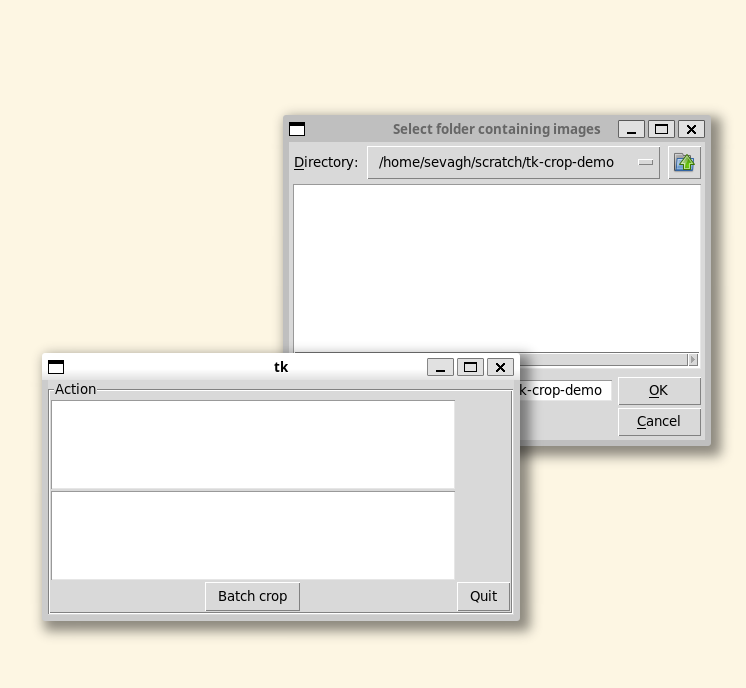
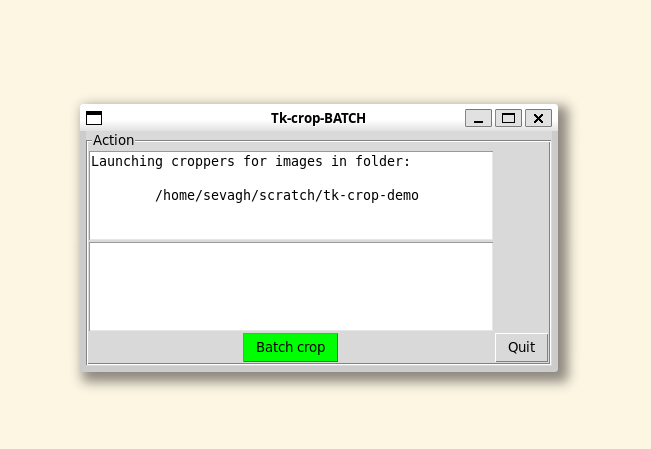
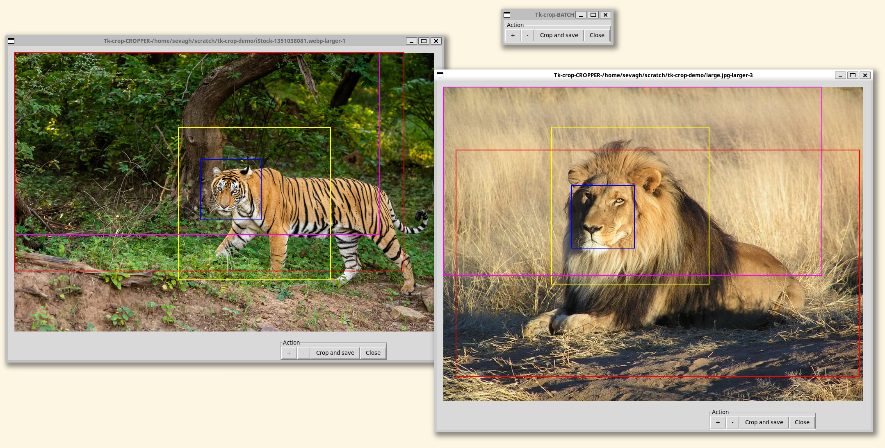

# tk-crop

This is a tiny demo Python/Tk application for batch cropping a folder of images with fixed-size rectangles. The code is [based on this](https://github.com/dnouri/photo_splitter).

Simply define the boxes and then drag and drop to crop! Images can be resized to fit the rectangles.

Define your own pixel sizes (arbitrary number of boxes supported) by changing the `FIXED_CROPS` list at the top of the script:
```
FIXED_CROPS = [
    ('A', {'height_px': 200, 'width_px': 200, 'color': 'blue'}),
    ('B', {'height_px': 500, 'width_px': 500, 'color': 'yellow'}),
    ('C', {'height_px': 600, 'width_px': 1200, 'color': 'magenta'}),
    ('D', {'height_px': 720, 'width_px': 1280, 'color': 'red'}),
]
```

## Usage

Simply clone this repo, install the requirements, and run the script:
```
$ git clone https://github.com/sevagh/tk-crop
$ cd tk-crop
$ python3 -m pip install -r ./requirements.txt
$ python3 ./tk-crop.py
```

When it launches, first navigate to a folder filled with images:
<br>



Then, drag and drop the cropping rectangles:


Press `Crop and save` to crop the area under each rectangle. The images will be saved with a special identifying suffix for the crop size:
```
new filename: /home/sevagh/scratch/tk-crop-demo/tk_crop__A__lion.jpg
new filename: /home/sevagh/scratch/tk-crop-demo/tk_crop__B__lion.jpg
new filename: /home/sevagh/scratch/tk-crop-demo/tk_crop__C__lion.jpg
new filename: /home/sevagh/scratch/tk-crop-demo/tk_crop__D__lion.jpg
```

Press `-|+` to shrink or grow the image in 10% increments; the images will be saved with LARGER/SMALLER identifiers:
```
new filename: /home/sevagh/scratch/tk-crop-demo/tk_crop__A__iStock-1351038081_LARGER_1.webp
new filename: /home/sevagh/scratch/tk-crop-demo/tk_crop__B__iStock-1351038081_LARGER_1.webp
new filename: /home/sevagh/scratch/tk-crop-demo/tk_crop__C__iStock-1351038081_LARGER_1.webp
new filename: /home/sevagh/scratch/tk-crop-demo/tk_crop__D__iStock-1351038081_LARGER_1.webp
```
